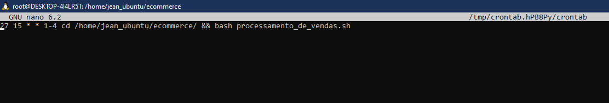

# Etapas - Passo a Passo da execução do Desafio

_Usei o WSL no windowns pra rodar o Linux e conforme o passo a passo indicado no desafio:

## Preparação
1. passo: Baixei o arquivo de dados sobre as vendas, dados_de_vendas.csv.
2. passo: Criei um diretório chamado ecommerce e aloquei o arquivo dados_de_vendas.csv.

[Diretório Ecommerce.](../Desafio/etapas/ecommerce/)

## Etapa I
3. passo: Criei um arquivo executável chamado processamento_de_vendas.sh para gerar o relatório de vendas, nesse arquivo foi inserido os seguintes comandos:
   1. Criar um diretório chamado vendas e copiar o arquivo dados_de_vendas.csv dentro dele.
   2. Criar um subdiretório chamado backup e copiar o arquivo dados_de_vendas.csv dentro dele renomeando-o como dados-data.csv. "data" será a data do dia em que ele for executado no formato YYYY/MM/DD.
   3. Renomear o arquivo dados-data.csv para backup-dados-data.csv.
   4. No diretório backup, criar um arquivo chamado relatorio.txt tendo como seu conteúdo a data de criação desse relatório, a data do primeiro e do último registro de venda contido no arquivo backup-dados-data.csv, a quantidade total de itens diferentes vendidos e as 10 primeiras linhas do arquivo backup-dados-data.csv.
   5. Comprimir o arquivo backup-dados-data.csv para backup-dados-data.zip.
   6. Apagar o arquivo backup-dados-data.csv do diretório backup e dados_de_vendas.csv do diretório vendas.

[Arquivo executável processamento_de_vendas.sh.](../Desafio/etapas/ecommerce/processamento_de_vendas.sh)

## Etapa II
4. passo: Agendei a execução do arquivo processamento_de_vendas.sh de segunda a quinta as 15:27 através do crontab.

## Etapa III
5. passo: Alterei os dados de vendas para serem substituídos antes de cada execução do arquivo processamento_de_vendas.sh.
6. passo: Criei um arquivo executável chamado consolidador_de_processamento_de_vendas.sh para unir todos os relatórios gerados e gerar outro arquivo chamado relatorio_final.txt.

[Arquivo executável consolidador_de_processamento_de_vendas.sh.](../Desafio/etapas/ecommerce/consolidador_de_processamento_de_vendas.sh)

# Entregáveis

- Arquivos dados_de_vendas.csv

   [1º arquivo dados_de_vendas.csv gerado/alterado](../Desafio/etapas/outros%20dados_de_vendas/2/dados_de_vendas.csv)

   [2º arquivo dados_de_vendas.csv gerado/alterado](../Desafio/etapas/outros%20dados_de_vendas/3/dados_de_vendas.csv)

   [3º arquivo dados_de_vendas.csv gerado/alterado](../Desafio/etapas/outros%20dados_de_vendas/4/dados_de_vendas.csv)

- Executáveis

   [Arquivo executável processamento_de_vendas.sh.](../Desafio/etapas/ecommerce/processamento_de_vendas.sh)

   [Arquivo executável consolidador_de_processamento_de_vendas.sh](../Desafio/etapas/ecommerce/consolidador_de_processamento_de_vendas.sh)

- Resultados

   [Resultado da execução do arquivo processamento_de_vendas.sh](../Desafio/etapas/ecommerce/vendas/backup/)

   [Resultado da execução do arquivo consolidador_de_processamento_de_vendas.sh](../Desafio/etapas/ecommerce/relatorio_final.txt)

_Conforme informado no video, as execuções foram feitas no intervalo de 1 minuto entre cada uma para fazer a demonstração, mas a configuração no crontab ficou conforme solicitado no desafio.

