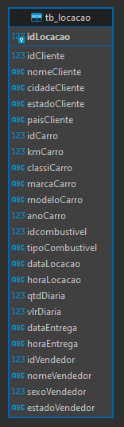
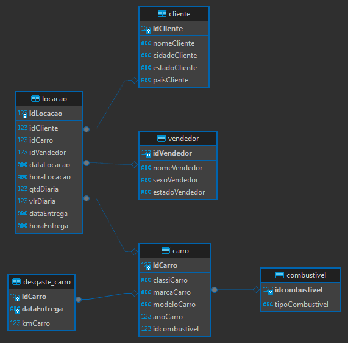
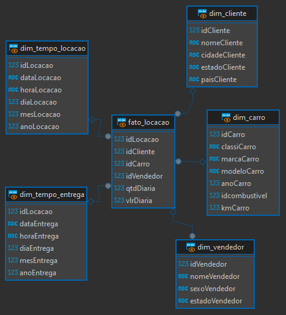

# Etapas

- Banco de Dados Concessionaria.

- Arquivo com Comandos .SQL para relosução do Desafio

## Etapa 1
- Primeiro fiz a normalização do banco de dados concessionaria para o modelo relacional. Para isso agrupei as colunas de acordo com o seu conteúdo, gerando novas tabelas apartir dos agrupamentos com foco no cliente, vendedor, carro, desgaste do carro, combustível e na locação.

## Etapa 2
- Apartir do modelo relacional, fiz o modelo dimensional, unindo algumas tabelas do modelo anterior(como as tabelas carro, desgaste_carro e combustivel), dividindo algumas(tabela locacao) e alterando a nomeclatura das tabelas de acordo com o padrão desse modelo. Na tabela fato mantive apenas as colunas com informações numéricas.

