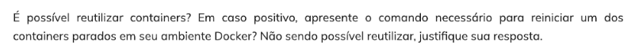

# Etapas

## Etapa 1
- Primeiramente, depois de ter construído o arquivo [Dockerfile](../Desafio/etapa-1/Dockerfile) e alocado o arquivo [carguru.py](../Desafio/etapa-1/carguru.py) na pasta etapa-1, vou para essa pasta usando o terminal.

- Crio a imagem usando o comando "docker build -t python-3 ." e para executar o arquio carguru.py basta executar um container apartir da imagem criada com o comando "docker run python-3".

- No arquivo Dockerfile indiquei a imagem que irei usar, python:3, logo após indiquei o diretório de trabalho do container e o arquivo que irei copiar para dentro dele. No final indiquei que fosse executado o arquivo quando fosse iniciado o container.

Veja a execução abaixo:

## Etapa 2
- Na etapa 2 é perguntado:

- É possível sim, para reutlizar um container que está parado basta usar o comando de reiniciar um container, "docker start <container_id>". 

- Veja um exemplo abaixo usando um container da imagem nginx que está em execução e depois é parado:

## Etapa 3
- Primeiro desenvolvi um código para gerar um hash de uma string através de um algoritmo da biblioteca hashlib. Salvei como [tohash.py](../Desafio/etapa-3/tohash.py)

- Depois construí um arquivo [Dockerfile](../Desafio/etapa-3/Dockerfile) para criar uma imagem chamada mascarar-dados com o comando "docker build -t mascarar-dados ." que executará o script em Python que foi criado anteriormente. 

- O arquivo Dockerfile seguirá a mesma lógica do Dockerfile da etapa 1, irei apenas mudar o nome do arquivo python e coloca-los em outra pasta.

- Para iniciar um container e mante-lo executando usarei o comando "docker run -it mascarar-dados".

- Usei duas palavras como exemplo de sua execução e para encerrar a execução do código basta digitar "exit". 

Veja a execução abaixo:

