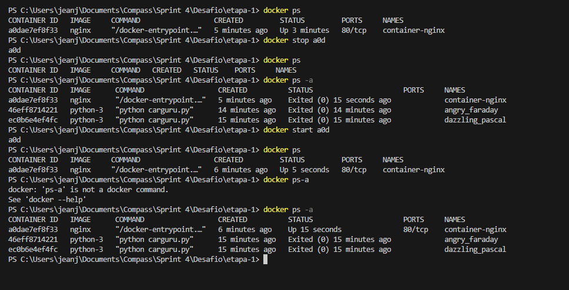
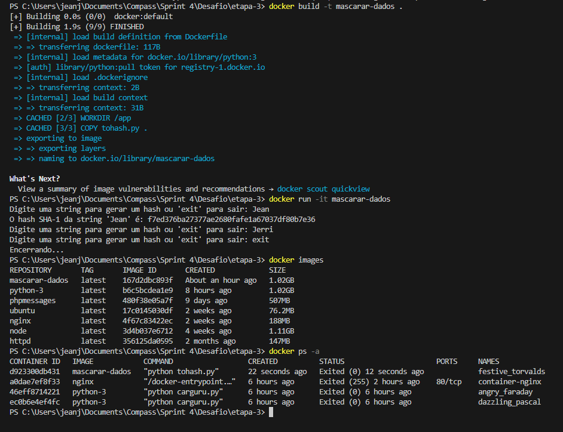

# Etapas

## Etapa 1
- Primeiramente, depois de ter construído o arquivo Dockerfile e alocado o arquivo carguru.py na pasta, vou para a pasta em que ele está localizado.

Crio a imagem usando o comando "docker build -t python-3 ." e para executar o arquio carguru.py basta executar um container apartir da imagem criada com o comando "docker run python-3".

No arquivo Dockerfile indiquei a imagem que irei usar, python:3, logo após indiquei o diretório de trabalho do container e o arquivo que irei copia-lo pra dentro dele. No final indiquei que fosse executado o arquivo quando fosse iniciado o container.

## Etapa 2
- É possível sim, basta reutlizar um container que está parado basta usar o comando de reiniciar um container, "docker start <container_id>". Veja um exemplo abaixo usando um container da imagem nginx que está parado:

## Etapa 3
- Depois irei contruir um arquivo Dockerfile para criar uma imagem chamada mascarar-dados com o comando "docker build -t mascarar-dados ." que executará o script em Python que foi criado anteriormente. O arquivo Dockerfile seguirá a mesma lógica do Dockerfile da etapa 1, irei apenas mudar o nome do arquivo python e coloca-los em outra pasta.

Para iniciar um container e mante-lo executando usarei o comando "docker run -it mascarar-dados".

Irei usar algumas palavras como exemplo de sua execução e para encerrar a execução do código basta digitar "exit".

